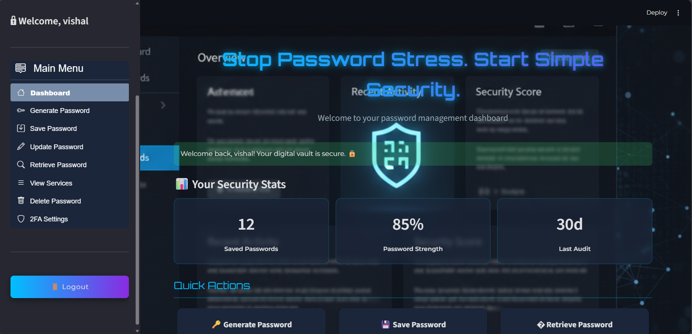
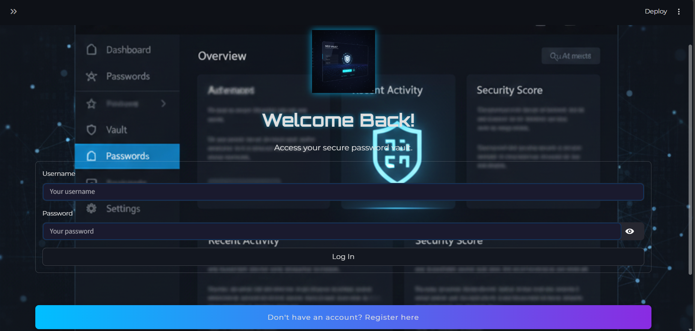
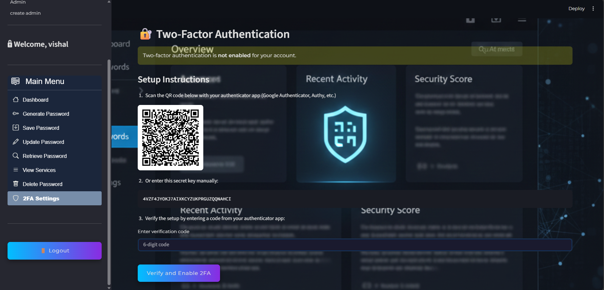
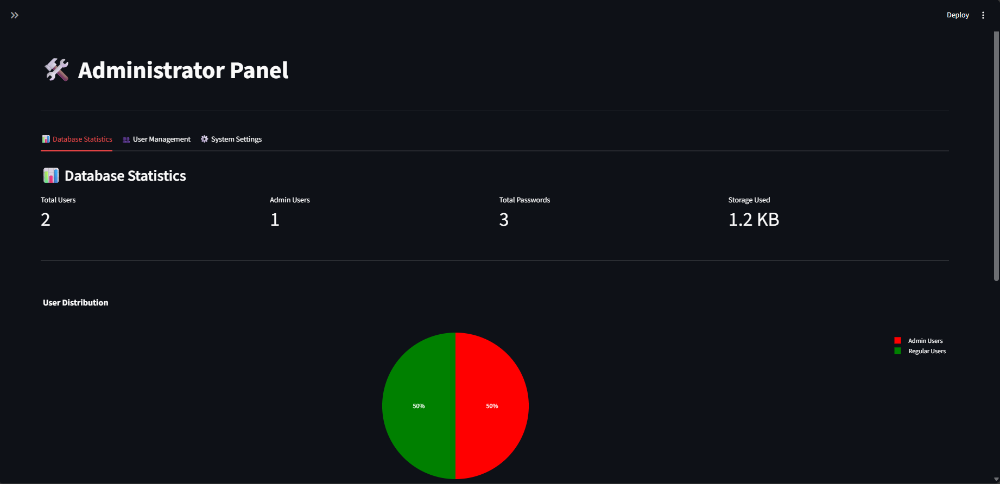

# 🔐 SentinelKey — Password Manager

A secure, modern password manager built with Streamlit and MongoDB. Store encrypted credentials, generate strong passwords, copy credentials to clipboard with automatic clearing, and protect accounts with TOTP-based 2FA. Designed for local/small-team use and as a learning/demo project for secure credential storage.

---

## Table of contents
- [Features](#features)
- [Demo / Screenshots](#demo--screenshots)
- [Tech stack](#tech-stack)
- [Requirements](#requirements)
- [Install & Run](#install--run)
- [Quick start](#quick-start)
- [Usage notes](#usage-notes)
- [Security & configuration](#security--configuration)
- [Project structure](#project-structure)
- [Development](#development)
- [Contributing](#contributing)
- [License & Acknowledgements](#license--acknowledgements)
- [Contact](#-contact)

---

## Features
- End-to-end encryption using Fernet (cryptography) for stored passwords
- User authentication with bcrypt-hashed passwords
- TOTP-based two-factor authentication (2FA) with QR code provisioning
- Clipboard copy with automatic timed clearance
- Password generator with customizable character sets
- CRUD operations for credentials (save, update, retrieve, delete)
- Admin utilities for user & database inspection and basic stats
- Session & rate-limit protections (auto logout, OTP attempt limiting)
- Simple Streamlit UI with separate pages for management and verification

---

## Demo / Screenshots

images to show:
- Dashboard overview (saved services & quick actions)
- Login Page UI
- 2FA provisioning (QR code)
- Admin panel statistics

## Demo / Screenshots
## Screenshots

<div align="center">
  <table>
    <tr>
      <td>
        <a href="assets/images/dashboard.png">
          
        </a>
      </td>
      <td>
        <a href="assets/images/login.png">
          
        </a>
      </td>
    </tr>
    <tr>
      <td align="center"><strong>Figure 1.</strong> Home Page overview</td>
      <td align="center"><strong>Figure 2.</strong>Login Page</td>
    </tr>
    <tr>
      <td>
        <a href="assets/images/2fa.png">
          
        </a>
      </td>
      <td>
        <a href="assets/images/admin.png">
          
        </a>
      </td>
    </tr>
    <tr>
      <td align="center"><strong>Figure 3.</strong>2 fa Setup</td>
      <td align="center"><strong>Figure 4.</strong>Admin Panel</td>
    </tr>
  </table>
</div>

---

## Tech stack
- Frontend: Streamlit
- Language: Python 3.8+
- Database: MongoDB (local or cloud)
- Encryption: cryptography (Fernet)
- Password hashing: bcrypt
- 2FA: pyotp, qrcode
- Clipboard: pyperclip
- Visualization & UI helpers: pandas, plotly (optional), Pillow

---

## Requirements
- Python 3.8 or higher
- MongoDB (local or Atlas)
- Internet connection only required for remote DB or package installs

Install dependencies:
```bash
pip install -r requirements.txt
```

Note: Your repo contains `requirements.txt.txt` — rename it to `requirements.txt` if necessary.

---

## Install & Run

1. Clone the repository:
```bash
git clone https://github.com/Vishal710-max/Password-manager.git
cd Password-manager
```

2. (Optional but recommended) Create and activate a virtual environment:
```bash
# macOS / Linux
python3 -m venv venv
source venv/bin/activate

# Windows PowerShell
python -m venv venv
venv\Scripts\Activate.ps1
```

3. Install dependencies:
```bash
pip install -r requirements.txt
```

4. Provide encryption configuration (recommended) — see [Security & configuration](#security--configuration).

5. Initialize the database (if you have an init script under `scripts/`, run it), or ensure MongoDB is running locally on default port or update `database.py` connection string.

6. Run the Streamlit app:
```bash
streamlit run demo.py
```
Open http://localhost:8501 in your browser.

---

## Quick start
- Create an account (register).
- Optionally create the default admin via the Create Admin page (useful for initial setup).
- Save a credential:
  - Enter service name (e.g., "Gmail"), service username (email), and a password (or generate a password).
- Retrieve a credential:
  - Click retrieve → password displayed, with a copy-to-clipboard button (clipboard auto-clears after the configured timeout).
- Enable 2FA:
  - Go to 2FA management, scan the QR code in your authenticator app, and confirm the code.

---

## Usage notes
- Service name validation: only letters, numbers, spaces, hyphens, and underscores are allowed.
- Passwords are encrypted in the DB — decrypted only when retrieved or displayed.
- Session state is managed via Streamlit session_state — logging out or restarting the app clears session data.
- The app is primarily intended for local/personal use. For production, use a secure deployment with TLS and authenticated MongoDB.

---

## Security & configuration

1. Encryption key (Fernet)
   - The app uses a Fernet key for encryption. Provide a base64 URL-safe key via environment variable `PASSWORD_MANAGER_ENCRYPTION_KEY` or in Streamlit secrets (`st.secrets['encryption_key']`).
   - To generate a secure key:
     ```bash
     python -c "from cryptography.fernet import Fernet; import base64; print(base64.urlsafe_b64encode(Fernet.generate_key()).decode())"
     ```
   - Never commit your encryption key to source control.

2. Database
   - Default connection string is `mongodb://localhost:27017/` in `database.py`.
   - For production, use a managed MongoDB (Atlas) with username/password, network access rules, and TLS.

3. Admin account
   - The Create Admin page creates a default admin user (`admin` / `admin123`) if not present. Change this password immediately after creation.
   - Admin-only pages check `st.session_state.current_user == 'admin'`.

4. OTP / 2FA
   - Uses TOTP (pyotp). Time window tolerance is implemented during verification to allow minor clock drift.
   - Rate-limits are in place: repeated incorrect OTP attempts trigger temporary account lock.

5. Clipboard
   - Clipboard copying uses pyperclip and a timed background clearance to reduce exposure of secrets in the system clipboard.

---

## Project structure
(high level — adjust if files change)
```
Password-manager/
├── demo.py                   # Main Streamlit application
├── database.py               # MongoDB manager & DB operations wrapper
├── encryption.py             # Encryption utilities (Fernet)
├── crud_operations.py        # High-level CRUD + business logic
├── clipboard_manager.py      # Clipboard handling & auto-clear timers
├── two_factor_auth.py        # TOTP secret, QR generation, verification helpers
├── pages/                    # Streamlit multi-page components (2FA, admin, locked, etc.)
│   ├── 2fa_management.py
│   ├── 2fa_verification.py
│   ├── Account_Locked.py
│   ├── Admin.py
│   └── create_admin.py
├── assets/
│   └── images/               # Logos and screenshots
├── scripts/                  # Utility scripts (e.g., DB initialization)
├── requirements.txt          # Python dependencies
└── README.md                 # This file
```

Files of interest:
- encryption.py — key handling, encryption_manager
- database.py — MongoDBManager and mongo_manager instance (CRUD DB calls)
- crud_operations.py — validation, secure save/retrieve/update/delete workflows
- clipboard_manager.py — copy and scheduled clearing
- two_factor_auth.py & pages/2fa_* — TOTP management and verification flows

---

## Development
- Recommended workflow:
  1. Fork and create a feature branch: `git checkout -b feature/your-feature`
  2. Implement and test locally
  3. Open a pull request with a clear description and testing steps
- Add tests where appropriate and consider adding a small CI pipeline for linting and unit tests.
- Keep secret material (Fernet keys, DB credentials) out of the repository — use environment variables or Streamlit secrets.

---

## Contributing
Contributions are welcome:
1. Fork the repository
2. Create a feature branch:
```bash
git checkout -b feature/my-feature
```
3. Commit changes with clear messages
4. Push and open a pull request describing changes and testing instructions

Please open an issue to discuss larger changes before implementing.

---

## License & Acknowledgements
-- This project is provided for personal and educational use.
- Acknowledgements:
  - Streamlit — UI framework
  - cryptography — encryption utilities
  - bcrypt — secure password hashing
  - pyotp & qrcode — TOTP 2FA
  - pyperclip — clipboard handling
  - pymongo — MongoDB driver

---

## 📬 Contact

<div align="center">

### **Vishal Bhingarde**

*React Developer | DSA Learner | Frontend Enthusiast*

[](https://linkedin.com/in/vishal-bhingarde-bb23a2376)
[](https://github.com/Vishal710-max)
[](https://portfolio-sect.vercel.app)
[](mailto:bhingardevishal5@gmail.com)

</div>

---


## ⭐ Show Your Support

If you found this project helpful, please give it a ⭐️!

<div align="center">

**Made with ❤️ by Vishal Bhingarde**

[](https://github.com/Vishal710-max/Password-manager)
[](https://github.com/Vishal710-max/Password-manager/fork)

</div>

---

<div align="center">


